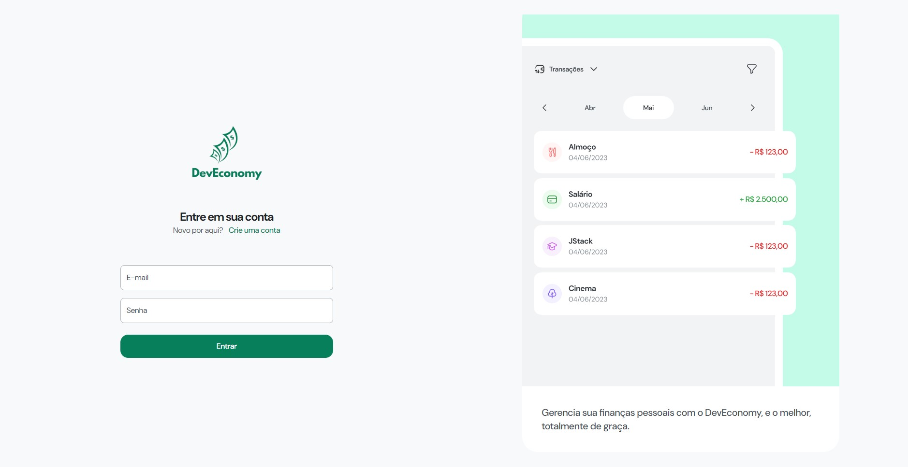
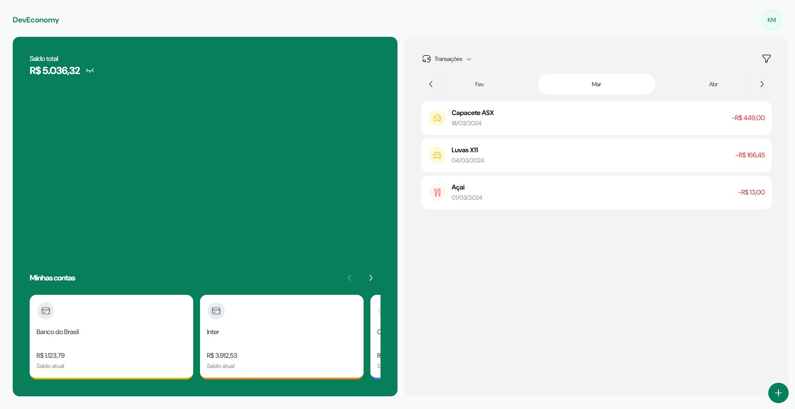
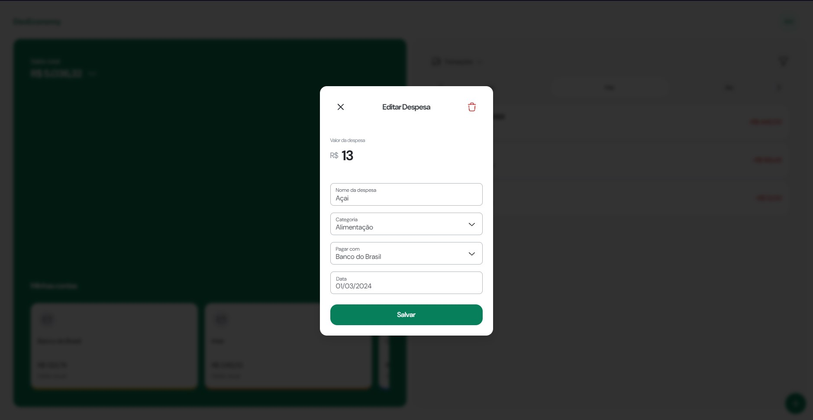

# DevEconomy - Gerenciador Financeiro Pessoal

## Descrição

O DevEconomy é um software desenvolvido para ajudar na gestão das finanças pessoais. Com esta aplicação, os usuários podem cadastrar suas contas correntes, contas de investimentos, despesas e receitas, além de ter a capacidade de filtrar por ano, mês e tipo de transação.

## Tecnologias Utilizadas

- Backend: [NestJS](https://docs.nestjs.com)
- Frontend: [ReactJS](https://react.dev)
- Banco de Dados: [PostgreSQL](https://www.postgresql.org)

### Mobile

  
  

### Web

## Repositórios

- [Backend](https://github.com/moraiskaua/back-end-DevEconomy)